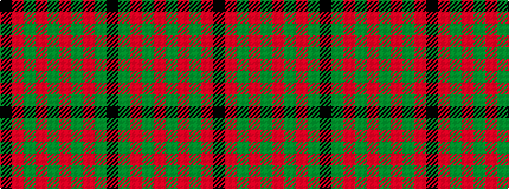

KGRGRGRGRK

It is a 10 stripe tartan.

<figure class="pat-woven">

<figcaption>idealised sample</figcaption>
</figure>

## Colour Sequence



## Tartans with this colour sequence

| Tartans |
|---------------|
| [MacDonald of Belfinlay](/variants/s10/k8g4r4g3r32g3r4g3r4k4~x2/)|
||
