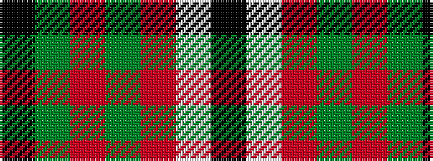

KGRGRWK

It is a 7 stripe tartan.

<figure class="pat-woven">

<figcaption>idealised sample</figcaption>
</figure>

## Colour Sequence



## Tartans with this colour sequence

| Tartans |
|---------------|
| [McNee (Name)](/setts/s7/k9w2r50g42r16g17k4/)|
||
