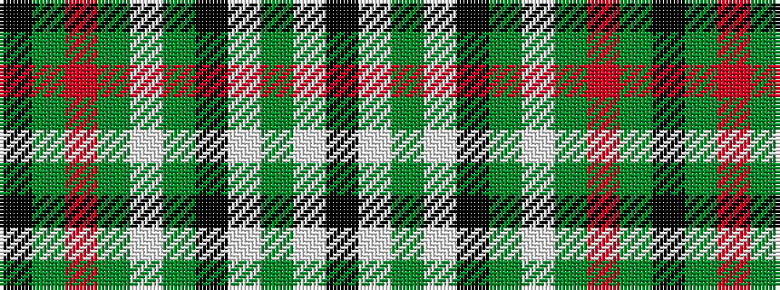

KGRGWGKWGWK

It is a 11 stripe tartan.

<figure class="pat-woven">

<figcaption>idealised sample</figcaption>
</figure>

## Colour Sequence



## Tartans with this colour sequence

| Tartans |
|---------------|
| [Grey Spencer Plaid](/variants/s11/k40y8o2y2w2y2k9w5y2w5k2~x2/)|
||
