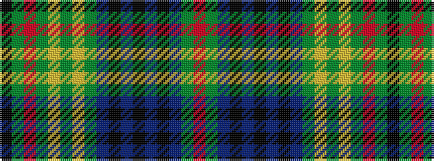

KGRGYGYGBKBKBKBGR

It is a 17 stripe tartan.

<figure class="pat-woven">

<figcaption>idealised sample</figcaption>
</figure>

## Colour Sequence



## Tartans with this colour sequence

| Tartans |
|---------------|
| [Myron](/setts/s17/k1g1r1g1lo1g1lo1g4db1k1db1k1db1k1db1g7r1~x4/)|
||
| [Myron](/setts/s17/k3g3m2g3ly2g2ly2g11db3k3db3k3db3k3db3g20r3~x2/)|
||
| [Myron Family Tartan Tartan Number: 1105. Earliest known date: pre 2003 Designed for the town celebrations of 1958-59 by G. Lawson of the Musselburgh Co-operative Society. See products available Copyright © Blair Urquhart, Comrie, 2015](/setts/s17/k3g3ri2g3ly2g2ly2g11db3k3db3k3db3k3db3g20r3~x2/)|
||
