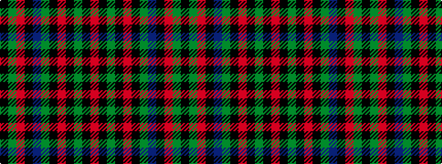

KGRKBGKRKGKR

It is a 12 stripe tartan.

<figure class="pat-woven">

<figcaption>idealised sample</figcaption>
</figure>

## Colour Sequence



## Tartans with this colour sequence

| Tartans |
|---------------|
| [Grant, Piper to the Laird of](/variants/s12/o24k2y8k2o8k1y24db6k2o14y18k4~x2/)|
||
