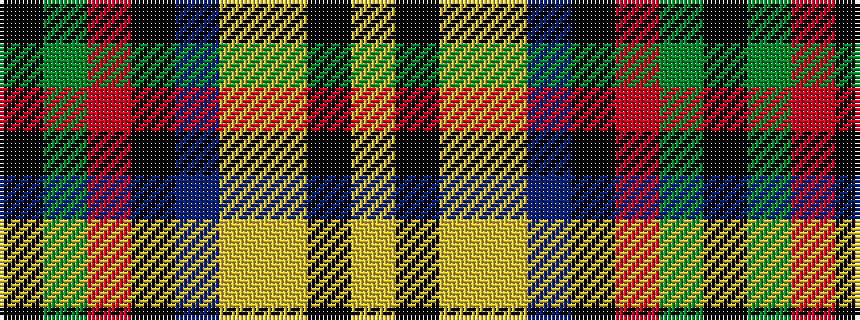

KGRKBYYKY

It is a 9 stripe tartan.

<figure class="pat-woven">

<figcaption>idealised sample</figcaption>
</figure>

## Colour Sequence



## Tartans with this colour sequence

| Tartans |
|---------------|
| [Down Irish County Tartan](/variants/s9/k65dy9r11k5t2lo2loi5k2lo13~x2/)|
||
