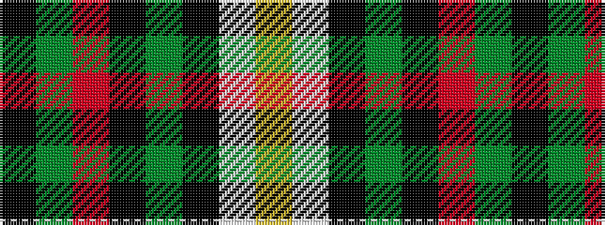

KGRKGKWY

It is a 8 stripe tartan.

<figure class="pat-woven">

<figcaption>idealised sample</figcaption>
</figure>

## Colour Sequence



## Tartans with this colour sequence

| Tartans |
|---------------|
| [Mission (District)](/setts/s8/lo2lb14k1g11k2r2g2k1~x4/)|
||
