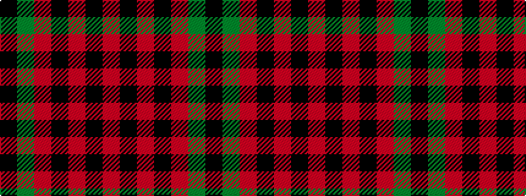

KGRKRKR

It is a 7 stripe tartan.

<figure class="pat-woven">

<figcaption>idealised sample</figcaption>
</figure>

## Colour Sequence



## Tartans with this colour sequence

| Tartans |
|---------------|
| [Unidentified #45](/variants/s7/k24dg3r3k24r2k2r2/)|
||
| [Unidentified 11](/variants/s7/k24g3r3k24r2k2r2/)|
||
