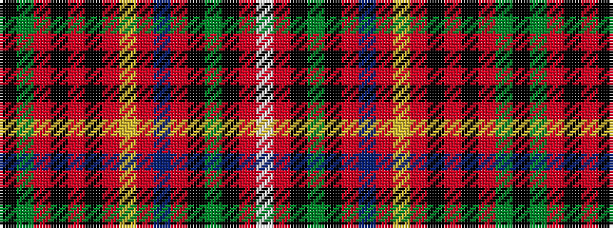

KGRKRKRYRBRKGKRW

It is a 16 stripe tartan.

<figure class="pat-woven">

<figcaption>idealised sample</figcaption>
</figure>

## Colour Sequence



## Tartans with this colour sequence

| Tartans |
|---------------|
| [Innes (D C Stewart)](/setts/s16/k2g12r2k2r2k2r16ly2r3db6r3k1g8k1r3w2~x2/)|
||
