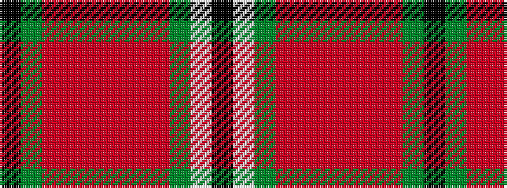

KGRRRRRRGWK

It is a 11 stripe tartan.

<figure class="pat-woven">

<figcaption>idealised sample</figcaption>
</figure>

## Colour Sequence



## Tartans with this colour sequence

| Tartans |
|---------------|
| [Gray Htg (Name)](/setts/s11/k3w1g29o8m2o2m2o2m8g7k2~x2/)|
||
