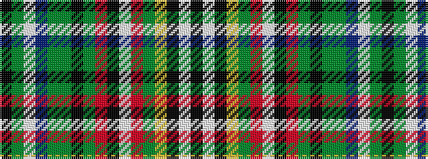

KGWBGGKGRKWRGYKWK

It is a 17 stripe tartan.

<figure class="pat-woven">

<figcaption>idealised sample</figcaption>
</figure>

## Colour Sequence



## Tartans with this colour sequence

| Tartans |
|---------------|
| [Le Cercle des Femmes (Corporate)](/setts/s17/k12g16lb2do12g2y10k4y8o27k30lb6o27g20lo4k2lb4k4~x2/)|
||
