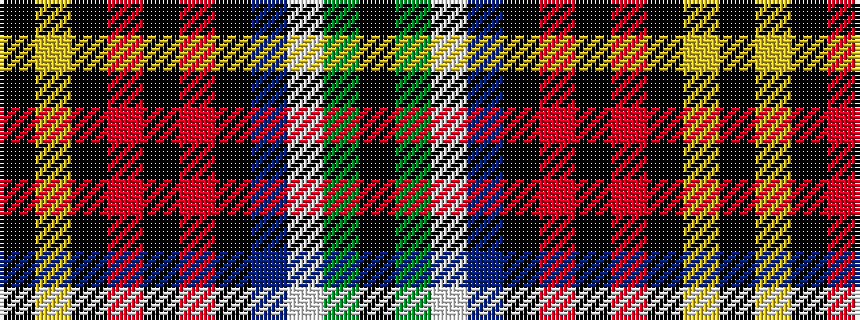

KGWBKRKRKYK

It is a 11 stripe tartan.

<figure class="pat-woven">

<figcaption>idealised sample</figcaption>
</figure>

## Colour Sequence



## Tartans with this colour sequence

| Tartans |
|---------------|
| [Hines Snr, Raymond Lee (Personal)](/variants/s11/k4dg2w2dp22k16r8k3r4k3ly4k3~x2/)|
||
