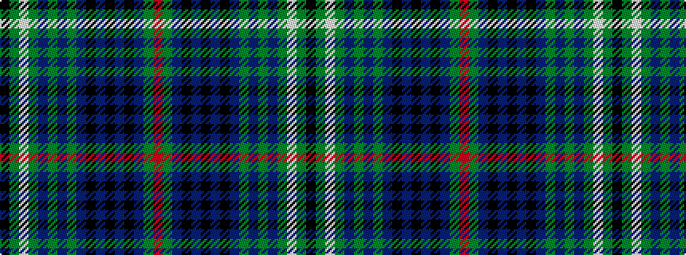

KGWGBGBGBKBKBKBGR

It is a 17 stripe tartan.

<figure class="pat-woven">

<figcaption>idealised sample</figcaption>
</figure>

## Colour Sequence



## Tartans with this colour sequence

| Tartans |
|---------------|
| [MacGlynn](/variants/s17/k3dg3w3dg3dpi3dg3dpi3dg15dp3k3dp3k3dp3k3dp3dg19r3~x2/)|
||
