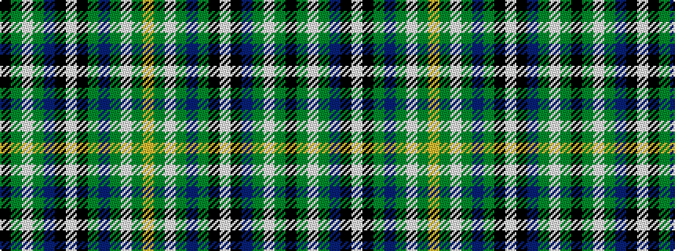

KGWGBKWKGBGWGY

It is a 14 stripe tartan.

<figure class="pat-woven">

<figcaption>idealised sample</figcaption>
</figure>

## Colour Sequence



## Tartans with this colour sequence

| Tartans |
|---------------|
| [Unidentified (Callander 2009)](/variants/s14/k5g16lb4g4b16k1w4k1g4b16g4lb4g16ly4~x2/)|
||
