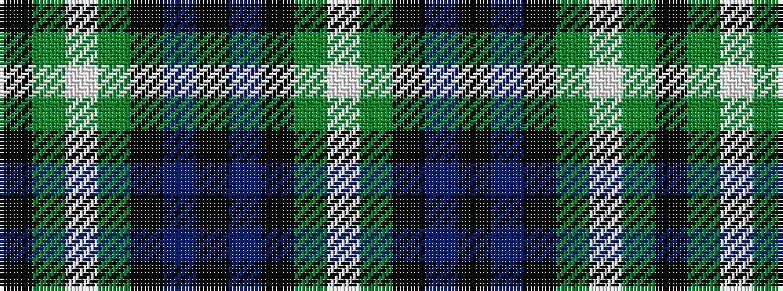

KGWGKBKBKGW

It is a 11 stripe tartan.

<figure class="pat-woven">

<figcaption>idealised sample</figcaption>
</figure>

## Colour Sequence



## Tartans with this colour sequence

| Tartans |
|---------------|
| [Graham of Montrose](/setts/s11/k4g4w1g4k4db4k1db4k4g4w1~x2/)|
||
| [Graham of Montrose #3](/setts/s11/k4dg4w1dg4k4db4k1db4k4dg4w1~x2/)|
||
