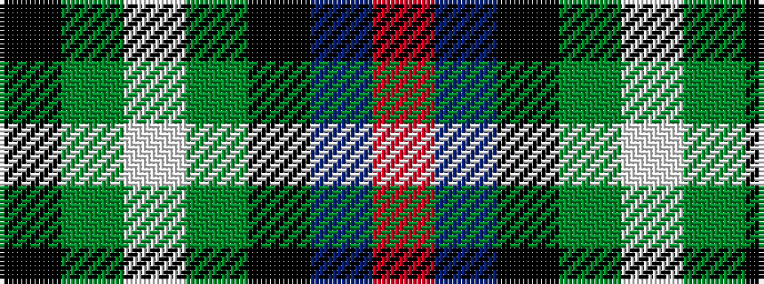

KGWGKBR

It is a 7 stripe tartan.

<figure class="pat-woven">

<figcaption>idealised sample</figcaption>
</figure>

## Colour Sequence



## Tartans with this colour sequence

| Tartans |
|---------------|
| [Cunningham / Wilson's No 120](/variants/s7/k11g12w2g12k12dp12r3~x2/)|
||
| [Wilson's, No 120](/variants/s7/k12g12w2g12k12p12r3~x2/)|
||
