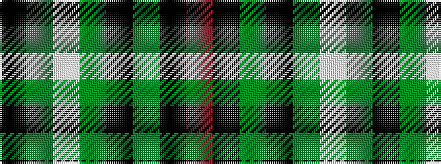

KGWGKGKR

It is a 8 stripe tartan.

<figure class="pat-woven">

<figcaption>idealised sample</figcaption>
</figure>

## Colour Sequence



## Tartans with this colour sequence

| Tartans |
|---------------|
| [Ata?, H.M. & I.C. (Personal)](/variants/s8/k9dg5w1dg15ki2dg1ki44r1~x2/)|
||
