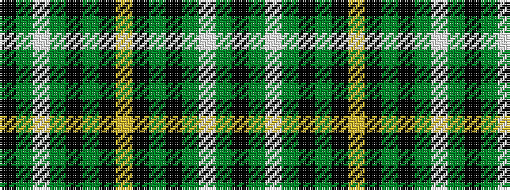

KGWGKGKYKGKGWGK

It is a 15 stripe tartan.

<figure class="pat-woven">

<figcaption>idealised sample</figcaption>
</figure>

## Colour Sequence



## Tartans with this colour sequence

| Tartans |
|---------------|
| [MacGiboney / MacGibboney](/setts/s15/k2dg4w2dg19k2y10k1ly2k1y10k2g19w2g4k2~x2/)|
||
