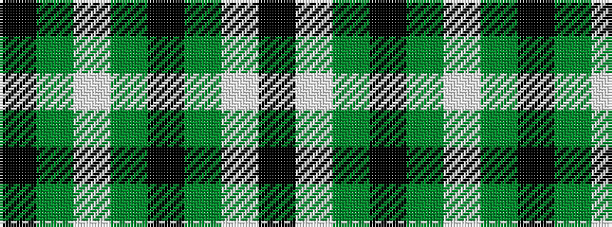

KGWGKGWK

It is a 8 stripe tartan.

<figure class="pat-woven">

<figcaption>idealised sample</figcaption>
</figure>

## Colour Sequence



## Tartans with this colour sequence

| Tartans |
|---------------|
| [Utah Valley University](/variants/s8/k3w7dg3k16dg17w1dg8k1~x2/)|
||
