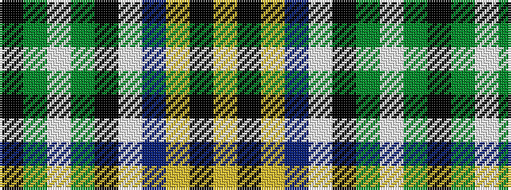

KGWGKWBYKY

It is a 10 stripe tartan.

<figure class="pat-woven">

<figcaption>idealised sample</figcaption>
</figure>

## Colour Sequence



## Tartans with this colour sequence

| Tartans |
|---------------|
| [Bird Family (Wales) (Personal)](/setts/s10/lo4k28lo2dp7w3k9g2w4g2k2~x2/)|
||
