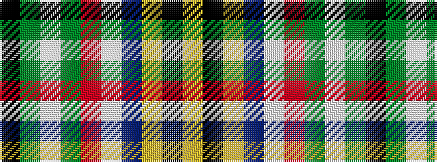

KGWGRWBYKY

It is a 10 stripe tartan.

<figure class="pat-woven">

<figcaption>idealised sample</figcaption>
</figure>

## Colour Sequence



## Tartans with this colour sequence

| Tartans |
|---------------|
| [Bird Family (Personal)](/setts/s10/ly4k28ly2db7w3r9g2w4g2k2~x2/)|
||
