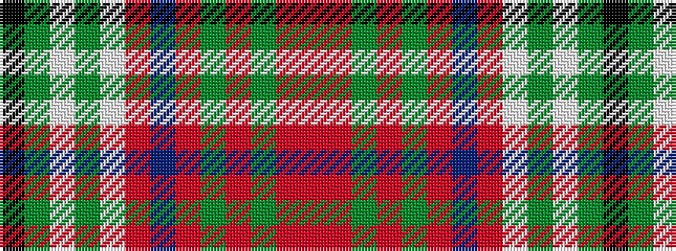

KGWGWRBRGRGRR

It is a 13 stripe tartan.

<figure class="pat-woven">

<figcaption>idealised sample</figcaption>
</figure>

## Colour Sequence



## Tartans with this colour sequence

| Tartans |
|---------------|
| [Crieff Red Dress (Dance)](/setts/s13/k2g2w2g3w33r2dp10r3g3r26g2r4r2~x2/)|
||
