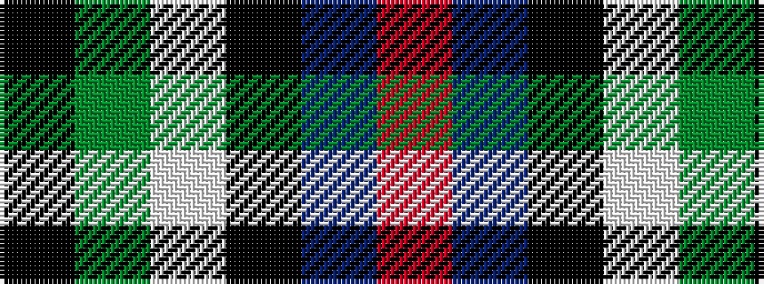

KGWKBR

It is a 6 stripe tartan.

<figure class="pat-woven">

<figcaption>idealised sample</figcaption>
</figure>

## Colour Sequence



## Tartans with this colour sequence

| Tartans |
|---------------|
| [Leslie Hunting](/setts/s6/k1g8w1k8db8r1~x4/)|
||
| [Leslie Hunting](/setts/s6/r2db8k8lb1dg8k1/)|
||
| [Leslie, hunting](/setts/s6/r2db8k8w1g8k1~x2/)|
||
