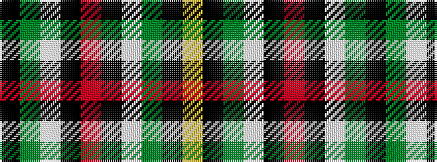

KGWKRKWGKY

It is a 10 stripe tartan.

<figure class="pat-woven">

<figcaption>idealised sample</figcaption>
</figure>

## Colour Sequence



## Tartans with this colour sequence

| Tartans |
|---------------|
| [Highlands of Durham #2](/variants/s10/k37g27w2k4r6k4w2g27k37ly2~x2/)|
||
