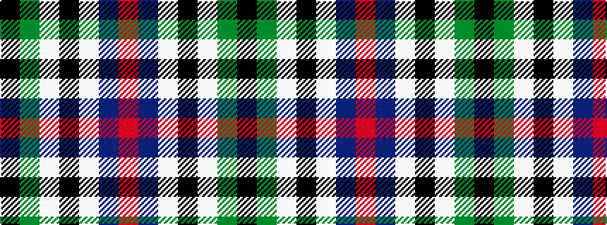

KGWKWBR

It is a 7 stripe tartan.

<figure class="pat-woven">

<figcaption>idealised sample</figcaption>
</figure>

## Colour Sequence



## Tartans with this colour sequence

| Tartans |
|---------------|
| [Caie (2013)](/variants/s7/k1dg8w1k8w1db8r1~x4/)|
||
