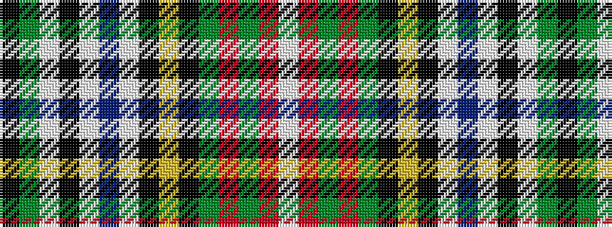

KGWKWBWKYKGRGRW

It is a 15 stripe tartan.

<figure class="pat-woven">

<figcaption>idealised sample</figcaption>
</figure>

## Colour Sequence



## Tartans with this colour sequence

| Tartans |
|---------------|
| [Stewart, Variant](/setts/s15/k6g10w10k2w23db10w2k6ly2k8g10r12g4r8w4/)|
||
| [Stuart/Stewart variant](/setts/s15/k6dg10w10k2w23db10w2k6ly2k8dg10r12dg4r8w4/)|
||
