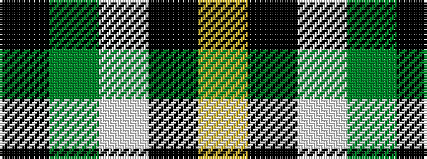

KGWKY

It is a 5 stripe tartan.

<figure class="pat-woven">

<figcaption>idealised sample</figcaption>
</figure>

## Colour Sequence



## Tartans with this colour sequence

| Tartans |
|---------------|
| [Perry, hunting (Green)](/variants/s5/k65g27w2k4ly5~x2/)|
||
