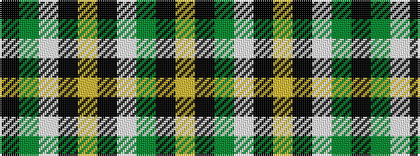

KGWKYKWGKY

It is a 10 stripe tartan.

<figure class="pat-woven">

<figcaption>idealised sample</figcaption>
</figure>

## Colour Sequence



## Tartans with this colour sequence

| Tartans |
|---------------|
| [Hamilton of Brandon](/setts/s10/lo16k7w1g7k1ly3~x4/)|
||
