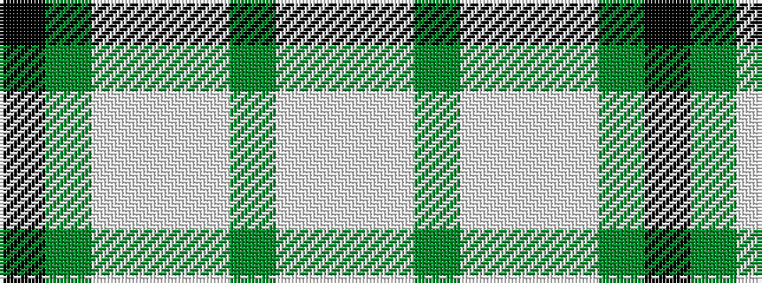

KGWWWGWW

It is a 8 stripe tartan.

<figure class="pat-woven">

<figcaption>idealised sample</figcaption>
</figure>

## Colour Sequence



## Tartans with this colour sequence

| Tartans |
|---------------|
| [Gairloch (Fashion)](/setts/s8/w24w1y9w1w9w2y2k2~x2/)|
||
