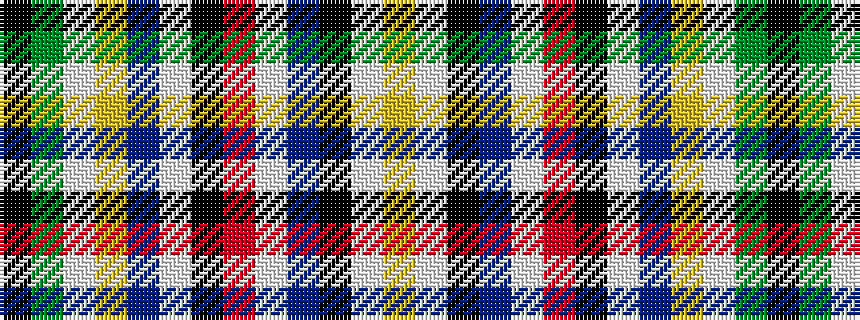

KGWYBWKRWBKWY

It is a 13 stripe tartan.

<figure class="pat-woven">

<figcaption>idealised sample</figcaption>
</figure>

## Colour Sequence



## Tartans with this colour sequence

| Tartans |
|---------------|
| [Mazarian](/variants/s13/ly6w4k3t14w3r34k34w4t3ly8w3g4k2~x2/)|
||
| [Nazarian (Personal)](/variants/s13/lo6w4k3t14w3r34k34w4t3lo8w3g4k2~x2/)|
||
