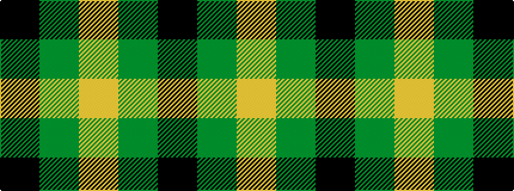

KGY

It is a 3 stripe tartan.

<figure class="pat-woven">

<figcaption>idealised sample</figcaption>
</figure>

## Colour Sequence



## Tartans with this colour sequence

| Tartans |
|---------------|
| [Wilson's, No 2/53 or Mull](/setts/s3/k5g4ly1~x2/)|
||
| [Zwijnenberg, Frans (Personal)](/setts/s3/k23g8ly8~x4/)|
||
| [Zwijnenberg, Frans (Personal)](/setts/s3/k23g8lo8~x4/)|
||
