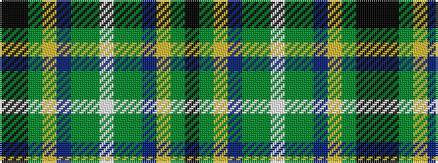

KGYBGGWGGBYGKK

It is a 14 stripe tartan.

<figure class="pat-woven">

<figcaption>idealised sample</figcaption>
</figure>

## Colour Sequence



## Tartans with this colour sequence

| Tartans |
|---------------|
| [Teviotdale District Tartan](/variants/s14/ki5k3dy4ly1db13dy13g29w2~x2/)|
||
