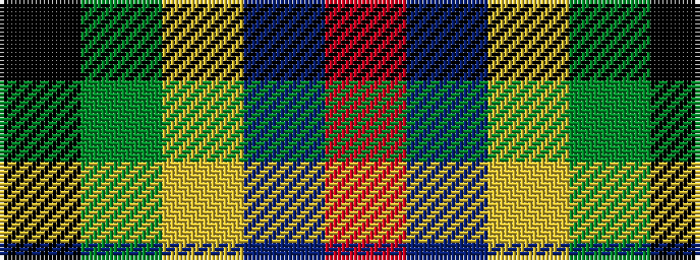

KGYBR

It is a 5 stripe tartan.

<figure class="pat-woven">

<figcaption>idealised sample</figcaption>
</figure>

## Colour Sequence



## Tartans with this colour sequence

| Tartans |
|---------------|
| [St Johns County Sheriff Office (Cor)](/variants/s5/r17db7lo8g58k6~x2/)|
||
| [St Johns County's Sheriff's Office](/variants/s5/r17db7lo8dg58k6~x2/)|
||
