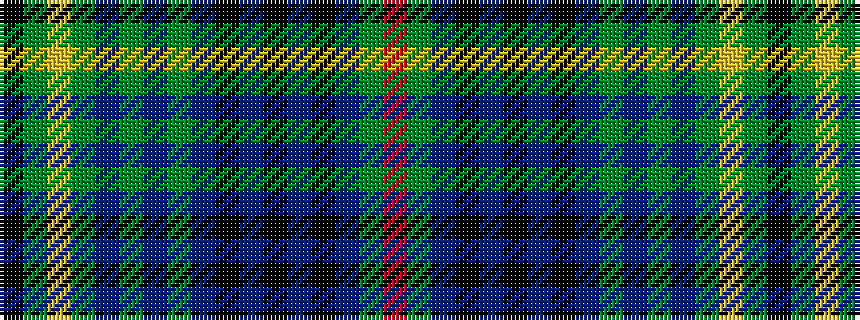

KGYGBGBGBKBKBKBGR

It is a 17 stripe tartan.

<figure class="pat-woven">

<figcaption>idealised sample</figcaption>
</figure>

## Colour Sequence



## Tartans with this colour sequence

| Tartans |
|---------------|
| [Kennedy](/setts/s17/k2dg2ly1dg3dr1dg2dr1dg12db4k3db3k3db3k3db4dg24r2~x2/)|
||
| [Kennedy (Clan)](/setts/s17/r3g24dt4k3dt3k3dt3k3dt4g12dp2g2dp2g3lo2g2k2~x2/)|
||
