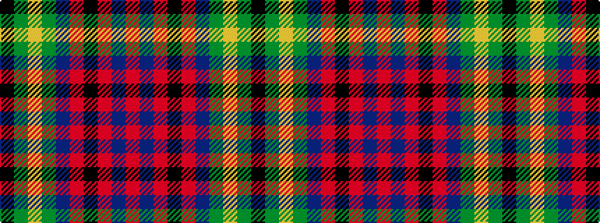

KGYGBRKRBR

It is a 10 stripe tartan.

<figure class="pat-woven">

<figcaption>idealised sample</figcaption>
</figure>

## Colour Sequence



## Tartans with this colour sequence

| Tartans |
|---------------|
| [Tupper, Sir Charles](/variants/s10/k4dy6lo3dy10dt14m6k18m6dt4m2~x2/)|
||
