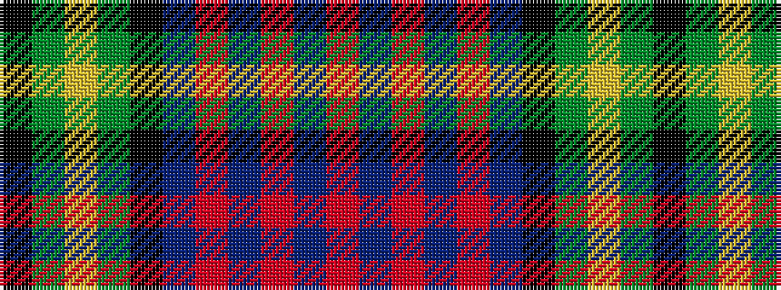

KGYGKBRBRBR

It is a 11 stripe tartan.

<figure class="pat-woven">

<figcaption>idealised sample</figcaption>
</figure>

## Colour Sequence



## Tartans with this colour sequence

| Tartans |
|---------------|
| [South Australia #2](/variants/s11/r6dbi24r3db12r7db12k3dg8ly3dg8k3/)|
||
