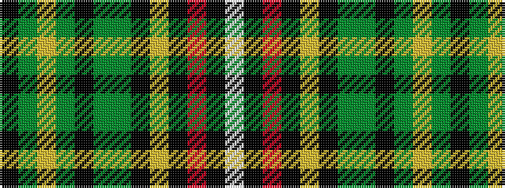

KGYGKGGKYKRKW

It is a 13 stripe tartan.

<figure class="pat-woven">

<figcaption>idealised sample</figcaption>
</figure>

## Colour Sequence



## Tartans with this colour sequence

| Tartans |
|---------------|
| [Donegal County Crest (Fashion)](/variants/s13/k4dg10lo4dg10k4g20dg5k2lo6k2r10k2w4~x2/)|
||
