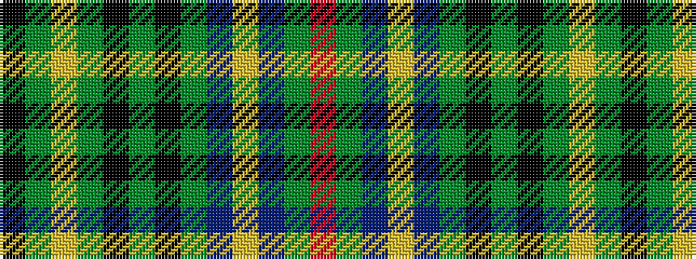

KGYGKGKGBYBGR

It is a 13 stripe tartan.

<figure class="pat-woven">

<figcaption>idealised sample</figcaption>
</figure>

## Colour Sequence



## Tartans with this colour sequence

| Tartans |
|---------------|
| [Bartlett from Winnetka, Illinois](/setts/s13/k3g3ly2g4k2g3k2g24db10ly2db10g30r3~x2/)|
||
| [Bartlett from Winnetka, Illinois](/setts/s13/r4g40db12lo2db12g30k2g4k2g4lo2g3k3~x2/)|
||
