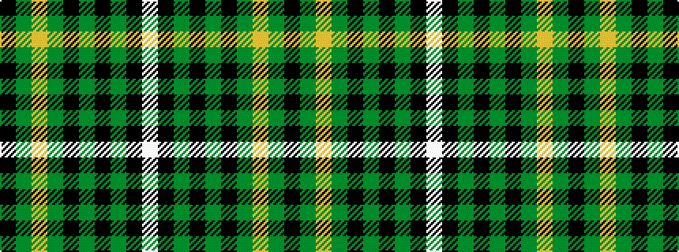

KGYGKGKGKW

It is a 10 stripe tartan.

<figure class="pat-woven">

<figcaption>idealised sample</figcaption>
</figure>

## Colour Sequence



## Tartans with this colour sequence

| Tartans |
|---------------|
| [Bruichladdich (Corporate)](/variants/s10/k3y3lo3y3k12y24k1y3k3w3~x2/)|
||
