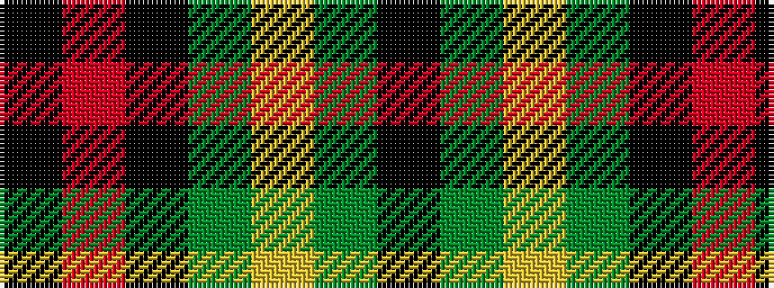

KGYGKRK

It is a 7 stripe tartan.

<figure class="pat-woven">

<figcaption>idealised sample</figcaption>
</figure>

## Colour Sequence



## Tartans with this colour sequence

| Tartans |
|---------------|
| [Blackstock Hunting](/setts/s7/k2r7k6g12ly1g1k2~x4/)|
||
