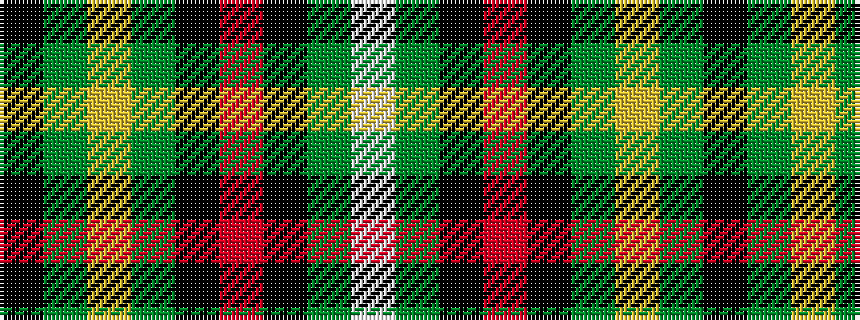

KGYGKRKGW

It is a 9 stripe tartan.

<figure class="pat-woven">

<figcaption>idealised sample</figcaption>
</figure>

## Colour Sequence



## Tartans with this colour sequence

| Tartans |
|---------------|
| [Unidentified #46](/variants/s9/w16dg2k5r2k10dg11ly2dg11k2~x2/)|
||
| [Unnamed 9](/variants/s9/w16g2k5r2k10g11ly2g11k2~x2/)|
||
