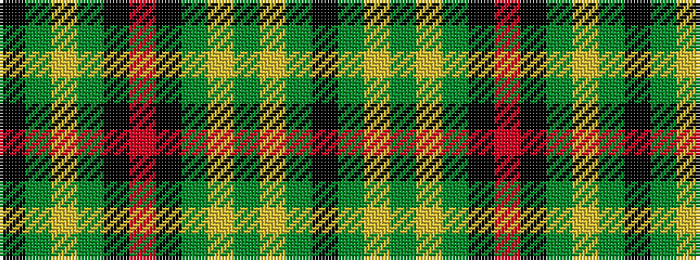

KGYGKRKGYGYGK

It is a 13 stripe tartan.

<figure class="pat-woven">

<figcaption>idealised sample</figcaption>
</figure>

## Colour Sequence



## Tartans with this colour sequence

| Tartans |
|---------------|
| [Greenshields, Alan (Personal)](/setts/s13/k4g20ly4g20ly26g4k10r3k16g18ly4g20k4/)|
||
