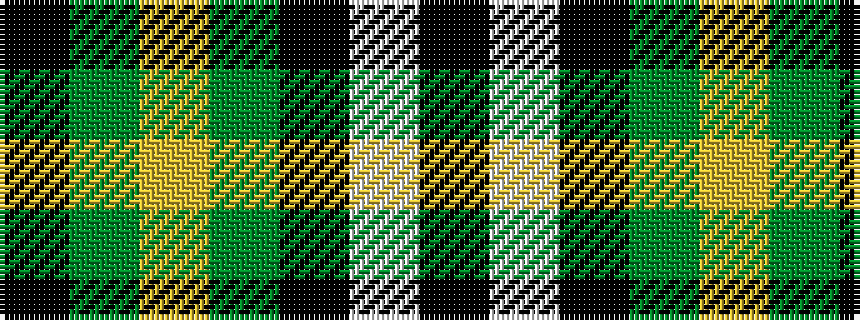

KGYGKWK

It is a 7 stripe tartan.

<figure class="pat-woven">

<figcaption>idealised sample</figcaption>
</figure>

## Colour Sequence



## Tartans with this colour sequence

| Tartans |
|---------------|
| [Boxer Beauty](/setts/s7/k13dy28lo13dy28k18w18k13~x2/)|
||
