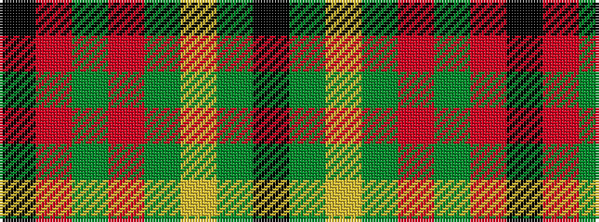

KGYGRGRK

It is a 8 stripe tartan.

<figure class="pat-woven">

<figcaption>idealised sample</figcaption>
</figure>

## Colour Sequence



## Tartans with this colour sequence

| Tartans |
|---------------|
| [Oakhall (Corporate)](/setts/s8/k3r48g6r6g12ly3g2k3~x2/)|
||
