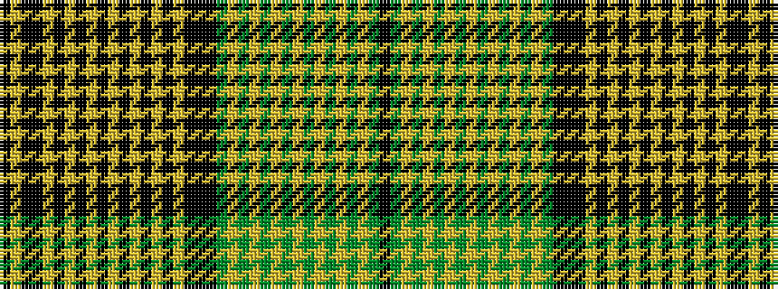

KGYGYGYGYGYGYGYGKKKYKYKYKYKYKYKYKKYK

It is a 36 stripe tartan.

<figure class="pat-woven">

<figcaption>idealised sample</figcaption>
</figure>

## Colour Sequence



## Tartans with this colour sequence

| Tartans |
|---------------|
| [Prince Edward Island (Commemorative)](/variants/s36/k50lo16k8ki8lo1ki1lo1ki1lo1ki1lo1ki1lo1ki1lo1ki1lo20ki40k12ki24dg8lo1dg1lo1dg1lo1dg1lo1dg1lo1dg1lo1dg1lo28dg6ki4/)|
||
