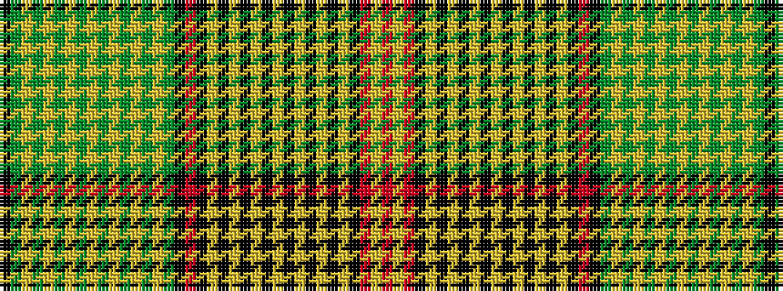

KGYGYGYGYGYGYGYGKRKYKYKYKYKYKYKYKRYR

It is a 36 stripe tartan.

<figure class="pat-woven">

<figcaption>idealised sample</figcaption>
</figure>

## Colour Sequence



## Tartans with this colour sequence

| Tartans |
|---------------|
| [Prince Edward Island (CIDD 28100)](/variants/s36/r50lo16r8k8lo1k1lo1k1lo1k1lo1k1lo1k1lo1k1lo20k40r12k24dg8lo1dg1lo1dg1lo1dg1lo1dg1lo1dg1lo1dg1lo28dg6k4/)|
||
