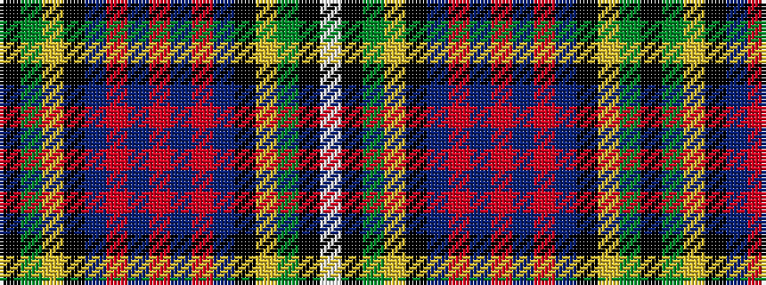

KGYKBRBRBRBKYGKW

It is a 16 stripe tartan.

<figure class="pat-woven">

<figcaption>idealised sample</figcaption>
</figure>

## Colour Sequence



## Tartans with this colour sequence

| Tartans |
|---------------|
| [Whitson](/setts/s16/lb4k1y19lo1k19n13r2n4r2~x4/)|
||
