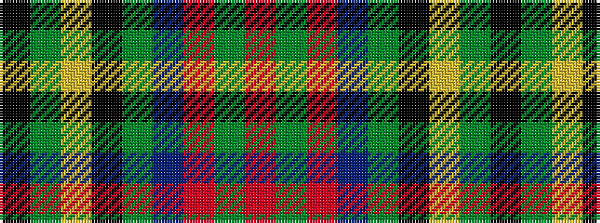

KGYKGBRGR

It is a 9 stripe tartan.

<figure class="pat-woven">

<figcaption>idealised sample</figcaption>
</figure>

## Colour Sequence



## Tartans with this colour sequence

| Tartans |
|---------------|
| [John.W.Mackay, Restricted](/setts/s9/k4g34ly1k18g3db18r3g3r3~x2/)|
||
| [Mackay, John W. (Personal)](/setts/s9/k4g35lo1k18g3db18r3g3r3~x2/)|
||
