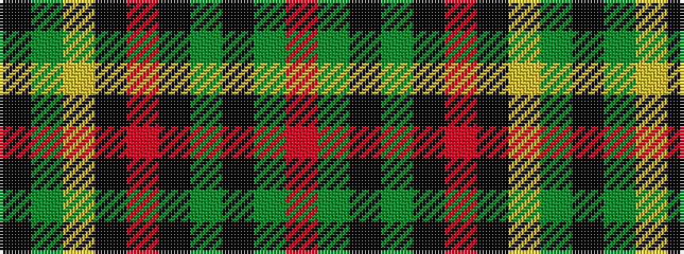

KGYKRKGKGR

It is a 10 stripe tartan.

<figure class="pat-woven">

<figcaption>idealised sample</figcaption>
</figure>

## Colour Sequence



## Tartans with this colour sequence

| Tartans |
|---------------|
| [Danareth](/setts/s10/k7g6ly3k12r19k12g62k62g12r7/)|
||
