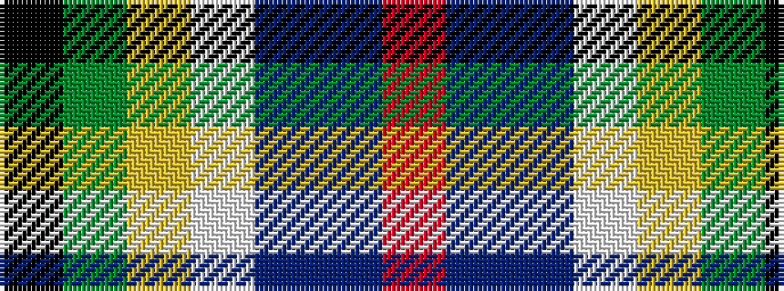

KGYWBBR

It is a 7 stripe tartan.

<figure class="pat-woven">

<figcaption>idealised sample</figcaption>
</figure>

## Colour Sequence



## Tartans with this colour sequence

| Tartans |
|---------------|
| [Nicolson of Taransay Hunting (Personal)](/variants/s7/r11dbi3db8w3ly3g5k5~x4/)|
||
